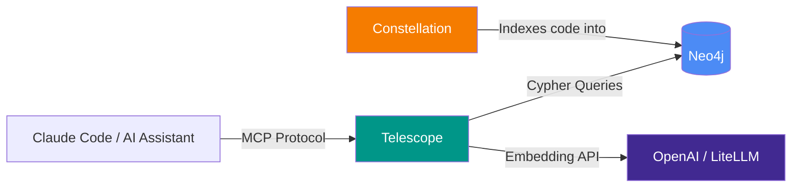

# Telescope

An MCP server that queries [Constellation](https://github.com/sriramdingari/Constellation)'s code knowledge graph. Feed it a natural language question and it searches across embedded entities using vector similarity, then lets you traverse the full persisted graph: files, packages, exports, fields, hooks, references, call graphs, impact, and class hierarchy.

Telescope is the query layer for Constellation. Constellation indexes codebases into Neo4j; Telescope lets AI assistants query that graph.

## Architecture



## Installation

### Prerequisites

- Python 3.12+
- A running [Constellation](https://github.com/sriramdingari/Constellation) deployment (Neo4j with indexed code)
- An OpenAI API key (or LiteLLM proxy) for query-time embedding generation

### Install from source

```bash
git clone https://github.com/sriramdingari/telescope.git
cd telescope
pip install .
```

### Install with uvx (no clone needed)

```bash
uvx --from git+https://github.com/sriramdingari/telescope.git telescope
```

## Setup with Claude Code

Add Telescope as an MCP server in Claude Code:

```bash
claude mcp add-json telescope --scope user '{
  "command": "uvx",
  "args": ["--from", "git+https://github.com/sriramdingari/telescope.git", "telescope"],
  "env": {
    "NEO4J_URI": "bolt://localhost:7687",
    "NEO4J_USER": "neo4j",
    "NEO4J_PASSWORD": "constellation",
    "OPENAI_API_KEY": "sk-your-key-here"
  }
}'
```

For LiteLLM proxy:

```bash
claude mcp add-json telescope --scope user '{
  "command": "uvx",
  "args": ["--from", "git+https://github.com/sriramdingari/telescope.git", "telescope"],
  "env": {
    "NEO4J_URI": "bolt://localhost:7687",
    "NEO4J_USER": "neo4j",
    "NEO4J_PASSWORD": "constellation",
    "OPENAI_API_KEY": "sk-your-litellm-key",
    "OPENAI_BASE_URL": "http://localhost:4000"
  }
}'
```

## Configuration

| Variable | Default | Description |
|----------|---------|-------------|
| `NEO4J_URI` | `bolt://localhost:7687` | Neo4j connection URI |
| `NEO4J_USER` | `neo4j` | Neo4j username |
| `NEO4J_PASSWORD` | `constellation` | Neo4j password |
| `OPENAI_API_KEY` | — | API key for embedding generation |
| `OPENAI_BASE_URL` | — | Custom base URL (e.g., LiteLLM proxy) |
| `EMBEDDING_MODEL` | `text-embedding-3-small` | Embedding model name |
| `EMBEDDING_DIMENSIONS` | `1536` | Vector dimensions |

## Tools

Telescope exposes 11 tools via the MCP protocol:

### search_code

Semantic code search using vector similarity. Better than grep for conceptual searches like "authentication logic" or "database connection handling".

```
search_code("payment processing", repository="my-app", entity_type="method", code_mode="preview")
```

| Parameter | Type | Default | Description |
|-----------|------|---------|-------------|
| `query` | string | required | Natural language search query |
| `repository` | string | — | Filter by repository name |
| `entity_type` | string | — | `"method"`, `"class"`, `"interface"`, or `"constructor"` |
| `file_pattern` | string | — | Filter by file path pattern |
| `limit` | int | 10 | Max results (capped at 20) |
| `code_mode` | string | `"preview"` | `"none"`, `"signature"`, `"preview"` (10 lines), `"full"` |

### find_symbols

Exact/substring graph lookup across all persisted entity types, including files, packages, fields, hooks, and references.

```
find_symbols("useState", entity_types=["hook"], repository="my-app")
```

### get_callers

Find all functions that call the specified method. Telescope derives interface/implementation families from Constellation's `IMPLEMENTS` and `EXTENDS` graph, instead of relying on method-level `OVERRIDES` edges.

```
get_callers("processPayment", repository="my-app", depth=2)
```

| Parameter | Type | Default | Description |
|-----------|------|---------|-------------|
| `method_name` | string | required | Method name to find callers for |
| `repository` | string | — | Filter by repository |
| `file_path` | string | — | Disambiguate by file path |
| `depth` | int | 1 | Traversal depth (max 3) |

### get_callees

Find all functions, unresolved references, and hooks used by the specified method.

```
get_callees("processPayment", repository="my-app")
```

Same parameters as `get_callers`.

### get_function_context

Get comprehensive context for a function before modifying it: code, signature, docstring, parent class, callers, and callees.

```
get_function_context("processPayment", repository="my-app")
```

`callees` can include real methods/constructors, unresolved `Reference` nodes, and `Hook` nodes.

### get_class_hierarchy

Get inheritance hierarchy for a class or interface, including parents, children, interfaces, implementors, methods, fields, and constructors.

```
get_class_hierarchy("UserService", repository="my-app")
```

### get_impact

Analyze blast radius of changing a method. Shows affected tests, endpoints, and other transitive callers.

```
get_impact("processPayment", summary_only=True)       # Quick count
get_impact("processPayment", limit=5)                  # Limited details
get_impact("validateUser")                             # Full analysis
```

| Parameter | Type | Default | Description |
|-----------|------|---------|-------------|
| `method_name` | string | required | Method to analyze |
| `repository` | string | — | Filter by repository |
| `file_path` | string | — | Disambiguate by file path |
| `depth` | int | 10 | Max call chain depth |
| `summary_only` | bool | false | Return counts only (no caller details) |
| `limit` | int | — | Max callers per category |

### get_file_context

Get graph context for a single file: package membership, exports, top-level entities, and hooks used inside that file.

```
get_file_context("src/App.tsx", repository="my-app")
```

### get_hook_usage

Find the methods and constructors that use a materialized hook node such as `useState` or `useEffect`.

```
get_hook_usage("useState", repository="my-app")
```

### list_repositories

List all repositories indexed by Constellation.

```
list_repositories()
```

### get_codebase_overview

High-level codebase statistics: files, classes, interfaces, methods, constructors, fields, packages, hooks, references, exports, languages, entry points, and top-level classes.

```
get_codebase_overview(repository="my-app", include_packages=True)
```

## Language Support

Telescope queries whatever Constellation has indexed. Currently supported languages:

| Language | Extensions |
|----------|-----------|
| Java | `.java` |
| Python | `.py` |
| JavaScript / TypeScript | `.js` `.ts` `.jsx` `.tsx` |
| C# | `.cs` |

## Development

```bash
git clone https://github.com/sriramdingari/telescope.git
cd telescope
pip install -e ".[dev]"
python -m pytest -v
```

## License

MIT
